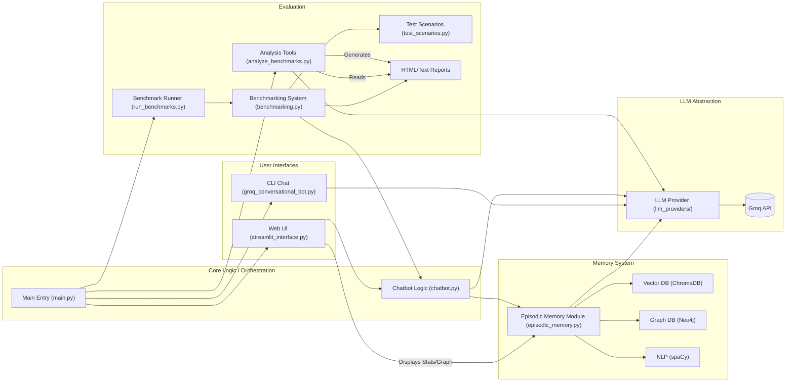

# Episodic Memory LLM - System Documentation

This document provides a detailed technical overview of the Episodic Memory LLM project, suitable for a research context. It covers the system's architecture, core components, algorithms, functionality, evolution, and implementation details.

## 1. Project Overview and Research Context

**Goal:** This research project investigates the enhancement of Large Language Models (LLMs) through the integration of an external, structured episodic memory system. The primary objective is to overcome the limitations of fixed context windows in standard LLMs by enabling them to store, retrieve, and reason about a larger, persistent set of past interactions or information snippets ("memories").

**Hypothesis:** By providing LLMs with access to a dynamically managed episodic memory, we can significantly improve performance on tasks requiring long-term context retention, factual consistency, temporal reasoning, and personalization, compared to baseline LLMs relying solely on their internal parameters and limited context windows.

**System Functionality:** The project implements a complete system encompassing:
- A core `EpisodicMemoryModule` providing the hybrid memory storage and retrieval logic.
- Integrations with LLM providers (initially focused on Groq models like Llama 3 and Mixtral).
- Interfaces for interaction and demonstration (CLI, Streamlit Web UI).
- A rigorous benchmarking suite to quantitatively evaluate the memory module's impact on specific metrics (latency, relevance, recall, consistency, etc.).
- Tools for analyzing benchmark results and generating reports, including LLM-powered qualitative analysis.

**Key Features & Evolution (derived from `README.md` & `CHANGELOG.md`):**
- **Hybrid Memory Recall:** Combines semantic vector search (ChromaDB) with structured graph traversal (Neo4j) and keyword matching for relevant memory retrieval (v1.3.0+).
- **Advanced Entity Extraction:** Utilizes spaCy and custom regex/patterns for improved recognition of diverse entities, including technical terms, multi-word phrases, URLs, etc. (v1.3.0+). Caching mechanisms enhance speed (v1.3.1+).
- **Adaptive Memory Scoring:** Employs an LLM for initial importance scoring, refined by factors like recency, reference count, and calculated relevance to the current context (v1.3.0+). Context preservation and keyword matching added to scoring (v1.3.1).
- **Context Preservation:** Specific algorithms and scoring adjustments focus on maintaining conversational context across turns (Improved in v1.3.1, v1.3.2).
- **Memory Maintenance:** Automated processes for memory decay (reducing importance over time) and cleanup (removing duplicates, orphaned entities).
- **Performance Optimization:** Includes caching layers for entity extraction and LLM responses, conditional search strategies, and robust error handling (v1.3.1, v1.3.2).
- **Benchmarking & Analysis:** Comprehensive system for comparing memory-enhanced vs. baseline LLMs on various metrics and scenarios.

## 2. System Architecture

The system employs a modular architecture designed for experimentation and evaluation.

**Data Flow Example (Web UI Chat):**
1.  User provides input via Streamlit UI (`streamlit_interface.py`).
2.  Input is sent to `Chatbot Logic` (`chatbot.py`).
3.  `Chatbot Logic` sends input to `LLM Provider` for immediate conversational response.
4.  Simultaneously/Sequentially, `Chatbot Logic` sends user input to `Episodic Memory Module` (`episodic_memory.py`).
5.  `EMM` processes the input:
    *   Extracts entities using `spaCy` / Regex.
    *   Calculates importance using `LLM Provider`.
    *   Stores memory embedding and text/metadata in `ChromaDB`.
    *   Stores memory node, entities, and relationships in `Neo4j`.
6.  `Chatbot Logic` may also query `EMM` with the input to `recall_memories`.
7.  `EMM` performs hybrid recall (querying `ChromaDB` & `Neo4j`).
8.  `EMM` returns relevant memories to `Chatbot Logic`.
9.  `Chatbot Logic` formats the LLM response and potentially includes summaries/references to recalled memories.
10. Result displayed in Streamlit UI.
11. Streamlit UI periodically queries `EMM` (`get_memory_stats`, `get_entity_relationships`) to update sidebar visualizations.

*(See `system_architecture.png` for an alternative visual representation)*

## 3. Core Components Deep Dive

### 3.1. `main.py` (Entry Point)

-   **Functionality**: Acts as the central CLI dispatcher. Uses `argparse` to route commands (`chat`, `benchmark`, `analyze`, `web`, `test`) to the appropriate modules. Initializes environment variables (`dotenv`).
-   **Implementation**: Standard `argparse` setup with subparsers. Dynamically imports and executes `main()` functions from target modules or uses `subprocess` (`web`) / `unittest` (`test`).

### 3.2. `src/episodic_memory.py` (Core Memory Module)

-   **Functionality**: This is the most critical component, implementing the `EpisodicMemoryModule`. Its primary role is to manage the lifecycle of memories.
    -   **Memory Representation**: Uses the `MemoryNode` dataclass to store memory text, timestamp, calculated importance, category, references, access times, and other metadata. Configuration is managed via `MemoryConfig`.
    -   **Storage**:
        *   **ChromaDB:** Stores `MemoryNode` text embeddings (using `SentenceTransformerEmbeddingFunction` with `all-MiniLM-L6-v2` by default) and associated metadata for fast semantic similarity search. Path: `./chroma_db`.
        *   **Neo4j:** Stores a graph representation: `Memory` nodes, `Entity` nodes (extracted via spaCy/regex, e.g., PERSON, ORG, TECH), and relationships (e.g., `[:CONTAINS]`, `[:RELATED_TO]`, `[:FOLLOWS]`). Schema (constraints, indexes) is initialized on startup (`_init_neo4j_schema`). Used for structured recall and relationship analysis.
    -   **Memory Ingestion (`store_memory`)**:
        1.  Calculates importance score using the LLM (`_calculate_memory_importance`) - involves prompting the LLM to rate the input text's significance, with robust JSON parsing (`_robust_json_parse`).
        2.  Extracts entities (`_extract_entities`) using spaCy NER and custom regex patterns (enhanced in v1.3.0+). Caching implemented (v1.3.1+).
        3.  Generates a unique ID (`uuid`).
        4.  Creates embeddings using the configured sentence transformer.
        5.  Stores embedding, text, and metadata in ChromaDB collection.
        6.  Creates `Memory` and `Entity` nodes and their relationships (`CONTAINS`, `RELATED_TO`) in Neo4j within a transaction (`_create_memory_with_entities`). Includes retry logic (`_execute_neo4j_query_with_retry`).
    -   **Memory Recall (`recall_memories`)**: Implements a hybrid strategy (enhanced in v1.3.0) to retrieve relevant memories based on a query:
        1.  **Semantic Search:** Queries ChromaDB for top N memories based on vector similarity to the query embedding.
        2.  **Keyword/Entity Search:** Extracts keywords/entities from the query. Queries Neo4j (`_get_related_memories_tx`, `_get_keyword_memories_tx`, `_get_entity_related_memories_tx`) to find memories directly linked to these keywords/entities or related entities in the graph.
        3.  **Ranking & Merging:** Results from different methods are combined, potentially re-ranked based on a scoring system considering importance, recency, relevance, reference count, and category diversity (v1.3.0+). Updates last access time (`_update_memory_access_tx`).
    -   **Memory Maintenance (Automated Background Tasks via `asyncio`)**:
        *   **Decay (`_run_periodic_decay`, `_apply_enhanced_memory_decay`)**: Periodically (e.g., daily), the importance score of memories decreases (`memory_decay_factor`). Memories below an `importance_threshold` and with fewer than `min_references_to_keep` may be pruned (unless recently accessed).
        *   **Cleanup (`_run_periodic_cleanup`)**: Periodically (e.g., twice daily), finds and removes duplicate memories (`_find_duplicate_memories_tx`) and orphaned entities (`_find_orphaned_entities_tx`).
    -   **Entity Relationships (`get_entity_relationships`)**: Queries Neo4j to retrieve pairs of related entities and their relationship strength, used for the knowledge graph visualization.
-   **Implementation**: Heavy use of `asyncio` for background tasks and potentially for some core operations. Uses `chromadb`, `neo4j`, `spacy` libraries. Employs `dataclasses`, `Enum`. Threading lock (`_lock`) suggests potential need for synchronization, although specific critical sections aren't detailed here. Robust error handling, especially around Neo4j queries (retries, backoff) and LLM interaction (JSON parsing).

### 3.3. `src/run_benchmarks.py` (Benchmark Orchestrator)

-   **Functionality**: Manages the execution of benchmark tests defined by the `benchmark` command.
    -   Parses specific arguments (`--model`, `--all-models`, `--simple`, `--advanced`, etc.).
    -   Defines the list of models to test (`BENCHMARK_MODELS`: includes various Groq models like Qwen, Mixtral, Mistral, Llama 3 variants).
    -   Iterates through selected models, incorporating delays (`--delay`) and retries (`--max-retries`) with exponential backoff to handle API rate limits or transient errors.
    -   Calls `BenchmarkingSystem.run_benchmarks` to execute tests for baseline and episodic configurations.
    -   Invokes `BenchmarkingSystem.generate_visualizations` to create model-specific plots (using Plotly).
    -   Saves raw metrics and summaries to a detailed text file (`benchmark_detailed_results_TIMESTAMP.txt`).
    -   Uses `utils.create_index.create_model_index_html` to generate an `index.html` report for each model's results directory.
    -   Generates cross-model comparison plots and an overall index (`generate_cross_model_comparison`, `create_cross_model_index`) if multiple models are tested.
    -   Outputs results to `--output-dir` (default: `visualizations/`).
-   **Implementation**: Uses `argparse`, `asyncio`. Coordinates activities between `BenchmarkingSystem`, `EpisodicMemoryModule`, `LLMProvider`, and scenario loading (`test_scenarios.py`). Uses `matplotlib` for generating *comparison* plots across models (distinct from Plotly used for individual model reports within `BenchmarkingSystem`).

### 3.4. `src/benchmarking.py` (Benchmarking Engine)

-   **Functionality**: Contains the core logic for evaluating the performance difference between the baseline LLM and the memory-enhanced LLM.
    -   `BenchmarkMetrics`: Class to aggregate metric scores (latency, accuracy, recall, etc.) during a run. Calculates averages and percentage improvements.
    -   `BenchmarkingSystem`:
        *   Takes LLM provider, test scenarios (`test_scenarios.py`), and model name.
        *   Executes scenarios (`run_traditional_benchmark`) using `SmartChatBot` with a dummy memory module (baseline).
        *   Executes scenarios (`run_episodic_benchmark`) using `SmartChatBot` with the actual `EpisodicMemoryModule` (after seeding memory with relevant context from scenarios via `_seed_memory_module`).
        *   Calculates Metrics: Implements various `_calculate_...` methods. These likely use a combination of:
            *   String similarity/keyword matching (for relevance, entity recall).
            *   Heuristics based on conversation structure (for coherence).
            *   Comparison with expected outputs (for factual accuracy).
            *   Checking presence/absence of key info (for context preservation, factual recall).
            *   The specific metrics tracked evolved, focusing on context preservation, entity/factual recall, relevance, and consistency (per `CHANGELOG.md`).
        *   Generates interactive Plotly visualizations (`generate_visualizations`) comparing baseline vs. episodic for the *current model* (e.g., radar charts, bar charts for accuracy, coherence, recall). Saves these as HTML within the model's results directory.
-   **Implementation**: Defines `BenchmarkMetrics`, `BenchmarkingSystem`. Relies on `plotly` for interactive plots, `pandas` for data structuring. Uses `SmartChatBot` as the test harness. The calculation methods (`_calculate_...`) are key to the quantitative evaluation in this research.

### 3.5. `src/streamlit_interface.py` (Web UI)

-   **Functionality**: Provides a graphical interface for interacting with the memory-enhanced chatbot and observing the memory state.
    -   Uses Streamlit widgets (`st.chat_input`, `st.chat_message`, `st.sidebar`, `st.metric`, `st.plotly_chart`).
    -   Manages state (`EpisodicMemoryModule` instance, LangChain `LLMChain` instance, chat history) using `st.session_state`. Uses Mixtral model by default here.
    -   **Interaction Flow:**
        1. User Input received.
        2. Input sent to LangChain `LLMChain` (`conversation.predict`) for immediate response generation.
        3. User Input (not response) sent to `EpisodicMemoryModule.store_memory`.
        4. `EpisodicMemoryModule.recall_memories` called with User Input.
        5. Relevant recalled memories filtered (e.g., by relevance score > 0.7).
        6. LLM response and relevant recalled memories displayed to the user.
    -   **Visualizations (Sidebar):**
        *   `Memory Statistics`: Displays total memories, average importance (`get_memory_stats`). Uses Plotly pie chart (`create_memory_stats_chart`) for distribution (age/category/type).
        *   `Knowledge Graph`: Fetches entity relationships (`get_entity_relationships`), uses `networkx` for layout (`spring_layout`), and `plotly` for rendering (`create_knowledge_graph`). Allows visual inspection of learned relationships.
-   **Implementation**: Standard Streamlit application structure. Uses `asyncio` helper for initializing `EpisodicMemoryModule`. Demonstrates practical integration of memory storage and recall within a conversational loop.

### 3.6. `src/utils/analyze_benchmarks.py` (Analysis Utility)

-   **Functionality**: Post-processes benchmark results, providing summaries and reports for the `analyze` command.
    -   Loads data primarily from the detailed `.txt` files generated by `run_benchmarks.py` (parsing with `re`), falling back to parsing HTML reports (using `BeautifulSoup`) if necessary.
    -   Aggregates metrics across different models if available.
    -   Generates static summary plots using `matplotlib` (bar charts, radar charts comparing models or metrics).
    -   Includes `analyze_with_groq`: Sends formatted benchmark data to a Groq LLM to obtain a qualitative textual summary and interpretation of the results.
    -   Generates a comprehensive `benchmark_report.html` file (`generate_report`) that combines quantitative metrics, `matplotlib` plots (embedded), and the LLM-generated qualitative analysis.
-   **Implementation**: File parsing (`re`, `BeautifulSoup`), plotting (`matplotlib`), LLM interaction (`groq`), HTML generation. Provides the final interpretation layer for the benchmark results.

### 3.7. `src/groq_conversational_bot.py` (Simple CLI Chat)

-   **Functionality**: A basic example CLI chatbot using LangChain and Groq (Llama 3). **Crucially, it does *not* integrate the `EpisodicMemoryModule`**. It serves as a baseline or simple demo.
-   **Implementation**: Standard LangChain setup: `ChatGroq`, `LLMChain`, `ChatPromptTemplate`, `ConversationBufferWindowMemory` (remembers last 5 turns). Simple `while` loop for interaction.

## 4. Supporting Files and Directories

-   **`src/llm_providers/`**: Abstracts LLM API interactions (`GroqProvider`, potentially others like `OpenAIProvider`). Defines base class `base.py`.
-   **`src/utils/create_index.py`**: Helper to generate `index.html` files within benchmark output directories, providing navigation and summary.
-   **`src/chatbot.py`**: Defines the `SmartChatBot` class, likely providing the core chat logic used by both the benchmarking system and potentially the Streamlit UI (needs verification), handling conversation state and interaction with the LLM provider and memory module.
-   **`src/test_scenarios.py`**: Provides structured test data (`get_simple_test_scenarios`, `get_advanced_test_scenarios`) used by `BenchmarkingSystem`. Each scenario includes input, expected output, context, entities, etc.
-   **`src/tests/`**: Contains `unittest` modules for testing components like `EpisodicMemoryModule`, etc.
-   **`chroma_db/`**: Default persistence directory for ChromaDB.
-   **`visualizations/`**: Default output directory for benchmark results (text files, plots, HTML reports).
-   **`.bat` files**: Windows batch scripts for convenience.
-   **`requirements.txt`**: Python dependencies.
-   **`README.md`, `CHANGELOG.md`, `details.md`**: Project documentation, version history, and supplementary details.

## 5. Key Algorithms and Concepts

-   **Vector Embeddings & Search**: Sentence Transformers (`all-MiniLM-L6-v2`) map text to vectors. ChromaDB uses approximate nearest neighbor search (e.g., HNSW) on these vectors for fast semantic retrieval based on cosine similarity or similar metrics.
-   **Graph Database & Traversal**: Neo4j stores entities and memories as nodes, linked by typed relationships. Cypher queries perform graph traversals (e.g., finding memories connected to an entity, finding related entities) for structured recall.
-   **Named Entity Recognition (NER)**: spaCy's pre-trained models (`en_core_web_sm`) identify standard entities. Custom regex patterns augment this for specific types (e.g., technical terms, URLs).
-   **LLM-Based Importance Scoring**: Prompt engineering is used to ask an LLM (`_calculate_memory_importance` in `episodic_memory.py`) to evaluate the significance of a text snippet, returning a normalized score. Requires robust parsing of the LLM's output.
-   **Hybrid Recall Strategy**: Combines results from vector search, keyword search, and graph traversal, merging and re-ranking them based on multiple factors (importance, recency, relevance, references) to improve recall accuracy and relevance (v1.3.0+).
-   **Memory Decay**: A mechanism (`_apply_enhanced_memory_decay`) to simulate forgetting. Importance scores decrease over time (multiplicative factor). Low-importance, infrequently accessed/referenced memories are candidates for pruning.
-   **Caching**: In-memory caches used for entity extraction results and potentially LLM responses to reduce latency and API calls (v1.3.1+).
-   **Benchmarking Metrics**: Quantitative evaluation relies on calculating specific scores based on comparisons between generated responses and expected outputs/contexts (see `_calculate_...` methods in `benchmarking.py`). Key metrics include latency, relevance, context preservation, entity recall, factual accuracy, and coherence.
-   **Plotting Algorithms**:
    -   Force-Directed Layout (`networkx.spring_layout`) for positioning nodes aesthetically in knowledge graph visualizations.
    -   Standard algorithms used by Plotly and Matplotlib for generating bar, pie, and radar charts from aggregated benchmark data.
-   **Exponential Backoff**: Standard algorithm used in retry logic for external API/DB calls to handle transient network issues or rate limits effectively.

## 6. How to Run

1.  **Setup**:
    *   Clone repository.
    *   Set up Python virtual environment & activate.
    *   Install dependencies: `pip install -r requirements.txt`.
    *   Configure `.env` file: Provide `GROQ_API_KEY`. Set Neo4j connection details (`NEO4J_URI`, `NEO4J_USER`, `NEO4J_PASSWORD`) if not using defaults (`bolt://localhost:7687`, `neo4j`, `password`). Ensure Neo4j instance is running and accessible. ChromaDB will use the local `chroma_db/` directory by default.
2.  **Execution Commands** (using `main.py`):
    *   Web UI (with Memory): `python main.py web` (Default: `http://localhost:8501`)
    *   CLI Chat (NO Memory): `python main.py chat`
    *   Run Default Benchmark: `python main.py benchmark`
    *   Run Benchmark (Specific Model): `python main.py benchmark --model [MODEL_NAME]` (e.g., `llama-3.1-8b-instant`)
    *   Run Benchmark (All Defined Models): `python main.py benchmark --all-models`
    *   Run Benchmark (Simple Scenarios): `python main.py benchmark --simple`
    *   Analyze Results & Generate Report: `python main.py analyze --generate-report` (Analyzes latest results in `visualizations/`)
    *   Run Unit Tests: `python main.py test`

---
*This documentation was auto-generated and enhanced based on code analysis, README.md, and CHANGELOG.md.*

</rewritten_file>