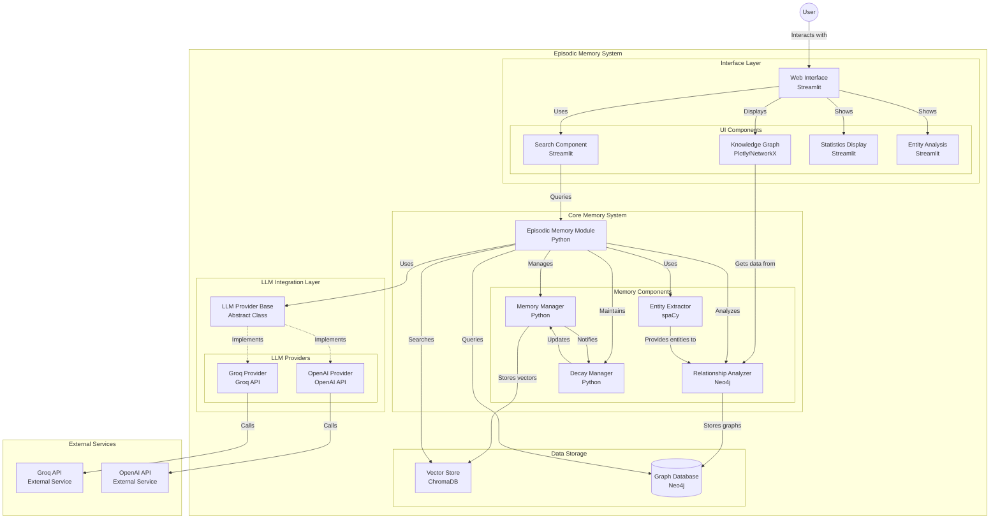

```mermaid
graph TB
    User((User))

    subgraph "Episodic Memory System"
        subgraph "Interface Layer"
            WebUI["Web Interface<br>Streamlit"]
            
            subgraph "UI Components"
                SearchComponent["Search Component<br>Streamlit"]
                KnowledgeGraph["Knowledge Graph<br>Plotly/NetworkX"]
                StatsDisplay["Statistics Display<br>Streamlit"]
                EntityAnalysis["Entity Analysis<br>Streamlit"]
            end
        end

        subgraph "Core Memory System"
            MemoryModule["Episodic Memory Module<br>Python"]
            
            subgraph "Memory Components"
                EntityExtractor["Entity Extractor<br>spaCy"]
                MemoryManager["Memory Manager<br>Python"]
                RelationshipAnalyzer["Relationship Analyzer<br>Neo4j"]
                DecayManager["Decay Manager<br>Python"]
            end
        end

        subgraph "LLM Integration Layer"
            LLMBase["LLM Provider Base<br>Abstract Class"]
            
            subgraph "LLM Providers"
                GroqProvider["Groq Provider<br>Groq API"]
                OpenAIProvider["OpenAI Provider<br>OpenAI API"]
            end
        end

        subgraph "Data Storage"
            VectorDB["Vector Store<br>ChromaDB"]
            GraphDB[("Graph Database<br>Neo4j")]
        end
    end

    subgraph "External Services"
        GroqAPI["Groq API<br>External Service"]
        OpenAIAPI["OpenAI API<br>External Service"]
    end

    %% Interface Layer Relationships
    User -->|Interacts with| WebUI
    WebUI -->|Uses| SearchComponent
    WebUI -->|Displays| KnowledgeGraph
    WebUI -->|Shows| StatsDisplay
    WebUI -->|Shows| EntityAnalysis

    %% Core System Relationships
    SearchComponent -->|Queries| MemoryModule
    KnowledgeGraph -->|Gets data from| RelationshipAnalyzer
    MemoryModule -->|Uses| EntityExtractor
    MemoryModule -->|Manages| MemoryManager
    MemoryModule -->|Analyzes| RelationshipAnalyzer
    MemoryModule -->|Maintains| DecayManager

    %% LLM Integration Relationships
    MemoryModule -->|Uses| LLMBase
    LLMBase -.->|Implements| GroqProvider
    LLMBase -.->|Implements| OpenAIProvider
    GroqProvider -->|Calls| GroqAPI
    OpenAIProvider -->|Calls| OpenAIAPI

    %% Data Storage Relationships
    MemoryManager -->|Stores vectors| VectorDB
    RelationshipAnalyzer -->|Stores graphs| GraphDB
    MemoryModule -->|Queries| GraphDB
    MemoryModule -->|Searches| VectorDB

    %% Component Interactions
    EntityExtractor -->|Provides entities to| RelationshipAnalyzer
    DecayManager -->|Updates| MemoryManager
    MemoryManager -->|Notifies| DecayManager
```